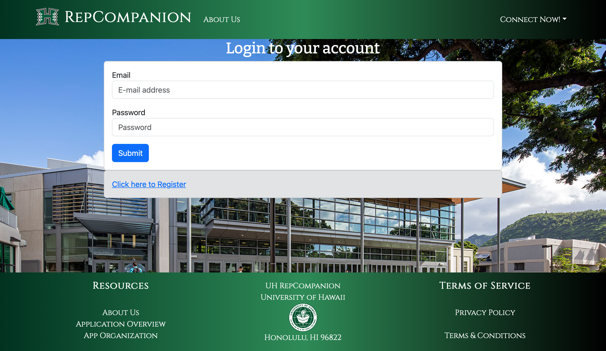
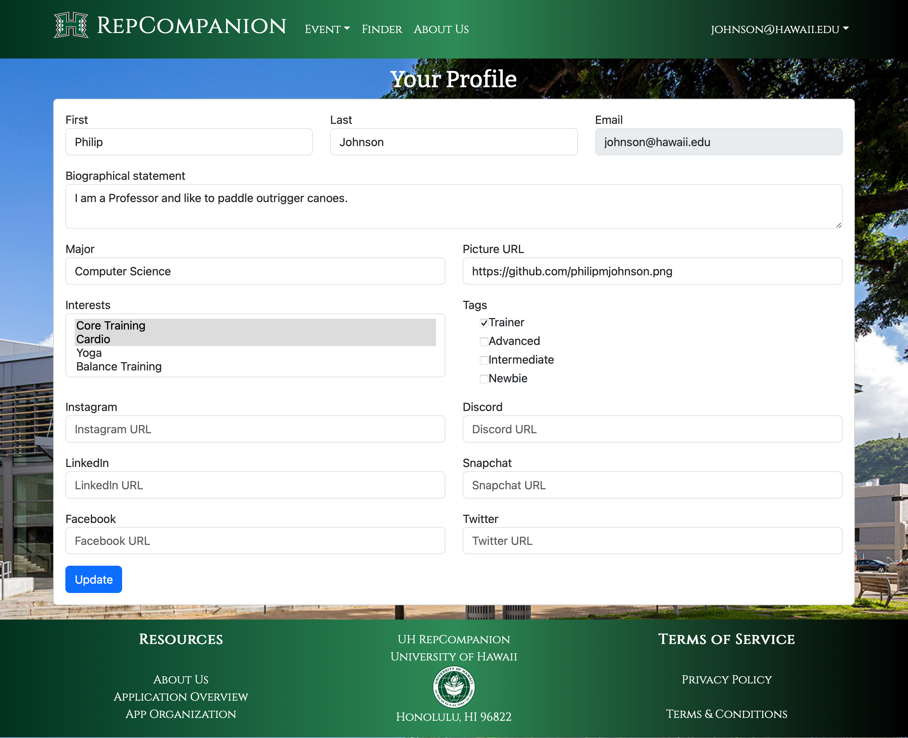
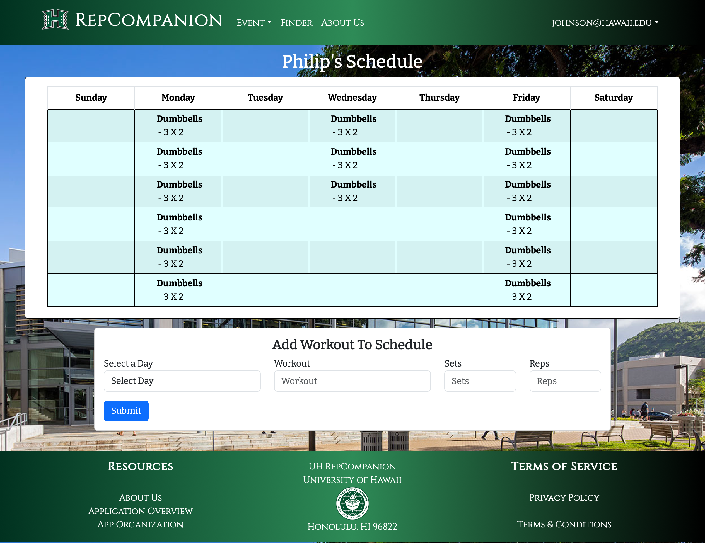
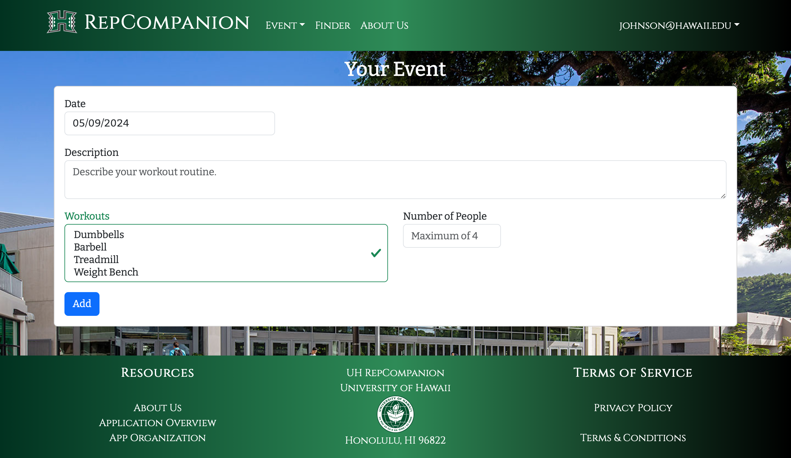

<style>
    .rounded-image {
        border-radius: 50%;
        overflow: hidden;
    }
</style>

<p align="center">

</p>


## GitHub Organization
[UH RepCompanion GitHub Organization](https://github.com/UH-RepCompanion)

[](https://github.com/UH-RepCompanion/RepCompanion-1/actions/workflows/ci.yml)


UH RepCompanion is an application that allows users to:

* Make an account and connect with other people who need a workout companion
* Keep track of their workout routines and schedules
* Socialize with other students on campus


## Overview

The problem: Many students struggle to maintain a consistent gym routine due to lack of motivation, accountability, and confidence. Additionally, finding a compatible workout partner with similar fitness goals and schedules can be challenging, leading to missed opportunities for support and encouragement during workouts.

The solution: RepCompanion is designed to connect students seeking gym partners. By matching users based on fitness goals, interests, availability, and preferred workout styles, RepCompanion helps students overcome shyness and build confidence while providing motivation and accountability to stick to their fitness routines. With RepCompanion, students can find compatible workout buddies who can push them to achieve their fitness goals, try new exercises, and stay committed to their health and wellness journey.


### Deployment

To access UH RepCompanion, please visit [uhrepcompanion.site](https://uhrepcompanion.site/)

### User Guide

This walkthrough will guide new users on how to navigate UH Repcompanion, what users can do within the application, and the different features that each page has.

### Landing Page

Upon arriving, you will be greeted with the UH RepCompanion landing page, which details what UH RepCompanion is, which should look something like this:


From here, users will be able to either login with a preexisting account or register a new account.

This page also contains a brief overview of what RepCompanion is and how it works. More information about the application can also be found on the About Us page.

### Login Page

Upon clicking on Login, users will be presented with a page where they can sign in using their UH email:



### Register Page

Alternatively if a user is new to the application, users can click on Register, which will direct them to a page where they can sign up and enter some basic info for their profile:





### Home Page (Logged In)

Once logged in, you will be directed to the home page, with links to the Events page and the Finder page. Within the navbar you will also be able to see links for the Event page, the Finder page, and the About Us page.


### Profile Page

When logged in, you can navigate to the Profile page in the top left dropdown menu which will allow you to view and edit your profile for the application. User profiles contain the user's RepCompanion information, social links, and a weekly calendar that allows the user to keep track of their personal routines.


### Schedule Page

Here users can keep track of their workouts via a personal schedule that can align with any events they have created, which will be reflected on their profile page.



### Finder Page

The Finder page allows users to filter through other users profiles based on search fields related to their interests in workouts. This page will also display other aspects of user's profiles such as their experience when it comes to working out (labeled as "Level"), an activity bar to show how active they are with their routine, and the option to contact that user:


### Event Page

The Event Page allows users to view any upcoming workout events made by other UH RepCompanion users. The event will include what equipment will be used during the workout, a short description of the workout itself, when the event will be occurring, and when the event was created.


### Add Event Page

The Add Event can be found within a dropdown menu from the Event tab located within the navbar, letting users add events to the Event Page. To create an event, enter the date for the workout event, a description of the workout, and what equipment will be incorporated into the workout.



### Community Feedback

### Ratings:
<span style="color: gold;">★☆☆☆☆</span> (1 out of 5 stars)

<span style="color: gold;">★★☆☆☆</span> (2 out of 5 stars)

<span style="color: gold;">★★★☆☆</span> (3 out of 5 stars)

<span style="color: gold;">★★★★☆</span> (4 out of 5 stars)

<span style="color: gold;">★★★★★</span> (5 out of 5 stars)


__
Raymond Mapa - <span style="color: gold;">★★★★★</span>__

"Very user-friendly and visually pleasing to use. I didn't encounter any issues when using the site and can see its future potential. It might be helpful to also allow users the option to change their account password."

__
Nathan Bueno - <span style="color: gold;">★★★★☆</span>__

"UH RepCompanion was easy to use and seems helpful for students. I think that there should be a messaging feature for students to chat with one another through the site."

### Developer Guide

### Installation

First, [install Meteor](https://www.meteor.com/install).

Second, go to [https://github.com/UH-RepCompanion/RepCompanion-1](https://github.com/UH-RepCompanion/RepCompanion-1), and click the "Use this template" button. Complete the dialog box to create a new repository that you own that is initialized with this template's files.

Third, go to your newly created repository, and click the "Clone or download" button to download your new GitHub repo to your local file system.  Using [GitHub Desktop](https://desktop.github.com/) is a great choice if you use MacOS or Windows.

Fourth, cd into the app/ directory of your local copy of the repo, and install third party libraries with:

```
$ meteor npm install
```

Finally, install MongoDB by visiting [https://www.mongodb.com/docs/manual/installation/](https://www.mongodb.com/docs/manual/installation/)

### Running UH RepCompanion

Once the libraries are installed, make sure you are still within the app/directory, then run the application by invoking:

```
$ meteor npm run start
```

The first time you run the app, it will create some default users and data. Here is what the output should look like:

```
 meteor npm run start 

> meteor-application-template-react@ start /Users/t/Documents/GitHub/RepCompanion-1/app
> meteor --no-release-check --exclude-archs web.browser.legacy,web.cordova --settings ../config/settings.development.json

[[[[[ ~/Documents/GitHub/RepCompanion-1/app ]]]]]

=> Started proxy.                             
=> Started HMR server.                        
=> Started MongoDB.                           
I20240421-14:13:59.686(-10)? Creating the default profiles
I20240421-14:13:59.698(-10)? Defining profile johnson@hawaii.edu
I20240421-14:14:02.886(-10)? Defining profile henric@hawaii.edu
I20240421-14:14:03.076(-10)? Defining profile cmoore@hawaii.edu
I20240421-14:14:03.187(-10)? Defining profile achriste@hawaii.edu
I20240421-14:14:03.459(-10)? Defining profile leighj@hawaii.edu
I20240421-14:14:03.735(-10)? Defining profile sin8@hawaii.edu
I20240508-20:45:34.465(-10)? Defining profile samdoan1@hawaii.edu
I20240508-20:45:34.830(-10)? Defining profile mcape@hawaii.edu
I20240508-20:45:34.917(-10)? Defining profile darius01@gmail.com
I20240508-20:45:35.015(-10)? Defining profile cashb15@gmail.com
I20240508-20:45:35.112(-10)? Defining profile tamuras6@hawaii.edu
I20240508-20:45:35.201(-10)? Defining profile kavehesfahni@gmail.com
I20240508-20:45:35.296(-10)? Defining profile athlu808@gmail.com
I20240508-20:45:35.386(-10)? Defining profile sammysmith@hawaii.edu
I20240508-20:45:35.474(-10)? Defining profile a_parayn2@gmail.com
I20240508-20:45:35.562(-10)? Defining profile markuswu02@gmail.com
I20240508-20:45:35.648(-10)? Defining profile tessiec@gmail.com
I20240508-20:45:35.736(-10)? Defining profile julietomas12@gmail.com
I20240508-20:45:35.831(-10)? Defining profile evanmonk9@gmail.com
I20240508-20:45:35.919(-10)? Defining profile victoriam12@gmail.com
I20240508-20:45:36.010(-10)? Defining profile kennynguyen408@gmail.com
I20240508-20:45:36.103(-10)? Creating the default events
I20240508-20:45:36.103(-10)? Defining event johnson@hawaii.edu
I20240508-20:45:36.215(-10)? Defining event evanmonk9@gmail.com
I20240508-20:45:36.220(-10)? Defining event a_parayn2@gmail.com
I20240508-20:45:36.229(-10)? Defining event mcape@hawaii.edu
I20240508-20:45:36.233(-10)? Defining event darius01@gmail.com
I20240508-20:45:36.236(-10)? Defining event kennynguyen408@gmail.com
I20240508-20:45:36.241(-10)? Creating the default schedules
I20240508-20:45:36.241(-10)? Defining schedule johnson@hawaii.edu
I20240508-20:45:36.468(-10)? Defining schedule johnson@hawaii.edu
=> Started your app.

=> App running at: http://localhost:3000/
I20240421-14:14:04.558(-10)? Monti APM: Connected
```

### Viewing the application

If all goes well, the template application will appear at [http://localhost:3000](http://localhost:3000).  You can login using the credentials in [settings.development.json](https://github.com/UH-RepCompanion/RepCompanion-1/blob/main/config/settings.development.json), or else register a new account.

### Modifying the application

If you wish to make stylistic modifications to the application, navigate to the app/client/ directory where you will find the style.css file. Within the app directory, you can find imports directory containing three sub-folders: api, startup, ui. 

The api folder contains folders with the basis for each collection, the startup folder which displays these collections upon the running of the app, and the ui which contains the components, pages, utilities, and layout of the application. 

The public directory contains the images for the application and the tests folder contains tests to run for each page if you wish to implement TestCafe into your work. Finally, you can find the default data for the application within the config directory. 

The application itself relies upon JSX, js, HTML, and CSS.

## Milestones

### M1
[Milestone 1 - Completion](https://github.com/orgs/UH-RepCompanion/projects/1)

### M2
[Milestone 2 - Completion](https://github.com/orgs/UH-RepCompanion/projects/9/views/1)

### M3
[Milestone 3 - Completion](https://github.com/orgs/UH-RepCompanion/projects/17)

## Team 
[Contract Link](https://docs.google.com/document/d/1tp4QYSD7dfjYHTd03d5IHFc6_XyA9PcVLbLC0lbu9PU/edit)

### Members

* __Blake Watanabe__ - I am currently a junior (about to be senior!) at UH Manoa and pursuing a Bachelor of Arts in Information & Computer Science with a focus on cyber security and software development. With my last 3 semesters at UH, I hope to gain many experiences that can help with my future career in the tech industry. Here's my [**Github Portfolio**](https://blakewatanabe.github.io)
* __Brandon Nelson__ - I am studying for a B.A. in Computer Science in the Department of Information and Computer Sciences at the University of Hawaii. I expect to graduate in Spring, 2025. I am hoping to pursue a career as a full-stack engineer. [**Github Portfolio**](https://bksnelson.github.io/)
* __Veronica Parayno__ - I am a junior at the University of Hawaii at Manoa, progressing towards a Bachelor of Science in Computer Science. My academic focus is on front-end development, where I aim to enhance my skills by creating immersive and functional digital interfaces. [**Github Portfolio**](https://veronicaparayno.github.io/).
* __Justin Natividad__ - I am pursuing a Bachelors of Science in Information & Computer Sciences at the University of Hawaii. I want to pursue a career in web and game developement and use it as a  way to show my creativity and my interest in the arts. I expect to graduate in Fall 2025. Here is my [**Github Portfolio**](https://jenativi.github.io/).
* __Anthony Tirabassi__ - I am currently pursuing a Bachelors of Arts in Information & Computer Sciences at the University of Hawaii Manoa. I will soon be entering my senior here at UH Manoa and am hoping to pursue a career in software engineering and game design/development. [**Github Portfolio**](https://t-tirabassi.github.io/).

