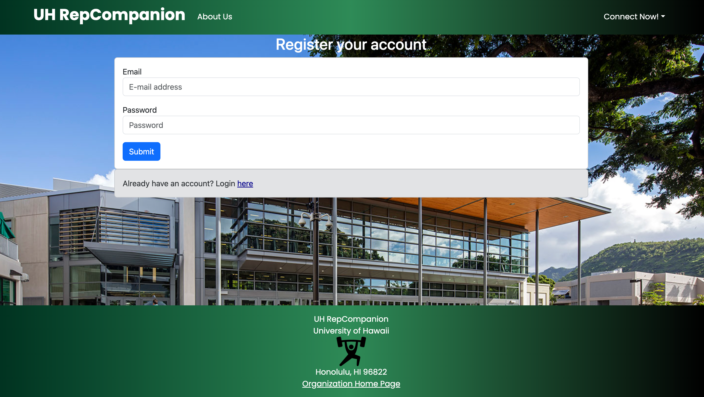
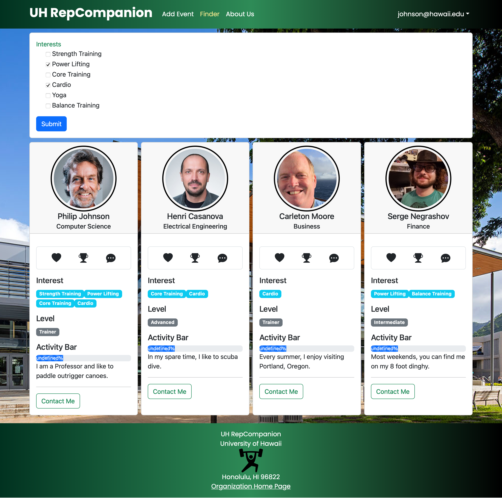

## GitHub Organization
[UH RepCompanion GitHub Organization](https://github.com/UH-RepCompanion)

UH RepCompanion is an application that allows users to:

* Make an account and connect with other people who need a workout companion
* Keep track of their workout routines and schedules
* Socialize with other students on campus

## Overview

The problem: Many students struggle to maintain a consistent gym routine due to lack of motivation, accountability, and confidence. Additionally, finding a compatible workout partner with similar fitness goals and schedules can be challenging, leading to missed opportunities for support and encouragement during workouts.

The solution: RepCompanion is designed to connect students seeking gym partners. By matching users based on fitness goals, interests, availability, and preferred workout styles, RepCompanion helps students overcome shyness and build confidence while providing motivation and accountability to stick to their fitness routines. With RepCompanion, students can find compatible workout buddies who can push them to achieve their fitness goals, try new exercises, and stay committed to their health and wellness journey.

### Deployment

To access UH RepCompanion, please visit [this site.](http://143.244.188.6/)

### Landing Page

Upon arriving, you will be greeted with the UH RepCompanion landing page, which should look something like this:

From here, users will be able to either login with a preexisting account or register a new account.

This page also contains a brief overview of what RepCompanion is and how it works. More information about the application can also be found on the About Us page.

### Login Page

Upon clicking on Login, users will be presented with a page where they can sign in using their UH email:

### Register Page

Alternatively if a user is new to the application, users can click on Register, which will direct them to a page where they can sign up and enter some basic info for their profile:

### Home Page (Logged In)

Once logged in, you will be directed to the home page and within the navbar you will be able to see links for an Add Event page, a Finder page, and the About Us page.

### Profile Page

When logged in, you can navigate to the Profile page in the top left dropdown menu which will allow you to view and edit your profile for the application.

### Finder Page

The Finder page allows users to filter through other users profiles based on search fields related to their interests in workouts. This page will also display other aspects of user's profiles such as their experience when it comes to working out (labeled as "Level"), an activity bar to show how active they are with their routine, and the option to contact that user:

### _(Further updates coming soon)_

## Milestones

### M1
[Milestone 1 Completion](https://github.com/orgs/UH-RepCompanion/projects/1)

### M2
[Milestone 2 _In Progress_](https://github.com/orgs/UH-RepCompanion/projects/9/views/1)

## Team 
[Contract Link](https://docs.google.com/document/d/1tp4QYSD7dfjYHTd03d5IHFc6_XyA9PcVLbLC0lbu9PU/edit)

### Members

* 
* 
* 
* 
* 
